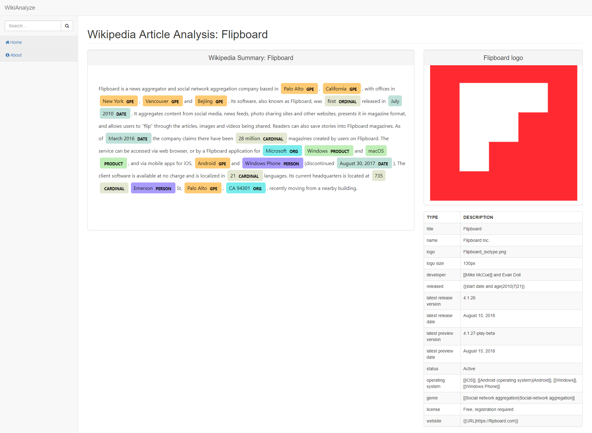
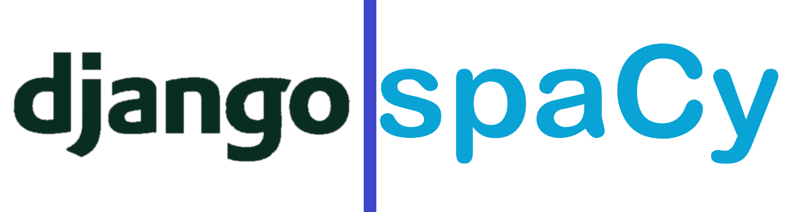

# WikiAnalyze

## Welcome to WikiAnalyze
WikiAnalyze is a project to search, find, and organize wikipedia's information into structured, formatted data.


(This screenshot is a demo of WikiAnalyzer's user interface, which lets you explore the data gleaned and organized from wikipedia articles.)  


The world is full of unstructured data. In 1998, Merrill Lynch cited a rule of thumb that somewhere around 80-90% of all potentially usable business information may originate in unstructured form. The majority of information on the web is unstructured, and exponentially increasing.

However, structuring that data can be a challenge. Techniques such as data mining, natural language processing (NLP), and text analytics provide different methods to find patterns in, or otherwise interpret, this information

**Our mission is to transform Wikipedia's unstructured information into a searchable, machine-learnable, API callable, and easily discernable database of information, to unleash a wealth of understanding and knowledge to the world.**


## Features
### Autonomous Data Scrapes 
Use WikiAnalyzer's API to autonomously scrape portions of Wikipedia's unstructured articles for valuable information. 
### Improved Wikipedia API
Our improved Wikipedia API can glean the data on a Wikipedia infobox. We are currently working on how to call individual infobox values, but you can view the ones we support on the web interface.
### Entity Recognition
WikiAnalyze harnesses the industrial strength of the spaCy natural language processing software to discern the entities in the wikipedia articles. We are exploring how the relationships of the entities can reveal an overall picture of the article. 

## Planned Features
### Caching with Django's ORM
We are planning to use Django's Object-Relational Mapper to cache searches and results. This has not been implemented yet, due to the fact Wikipedia has over [10,000 individualized infoboxes](https://en.wikipedia.org/wiki/Wikipedia:List_of_infoboxes). 

However, we have already started working on the more general infoboxes, as seen in "/app/models.py".


## Made Possible By the Following Technologies


### About Django 
"Django is a high-level Python Web framework that encourages rapid development and clean, pragmatic design. Built by experienced developers, it takes care of much of the hassle of Web development, so you can focus on writing your app without needing to reinvent the wheel. It’s free and open source."
-- Django website

### About SpaCy
Industrial-Strength Natural Language Processing. "spaCy is an open-source software library for advanced Natural Language Processing, written in the programming languages Python and Cython. The library is published under the MIT license and currently offers statistical neural network models for English, German, Spanish, Portuguese, French, Italian, Dutch and multi-language NER, as well as tokenization for various other languages." --Wikipedia
### Other projects
- Wikipedia API
- wptools

## Documentation
### Installing
- Please make sure you have Python 3.5 or greater installed.

Install the dependencies:
```shell
python -m pip install requirements.txt -r 
```

### Running
To start the project:

1. Start the django dev server:
```shell
python manage.py runserver
```

2. Navigate your browser to localhost:8000. 

3. Search for an article on Wikipedia, using the search sidebar

4. A list of results should appear. Click on desired link.

If you searched for 'flipboard', you will get a page with a result called "Flipboard". Cliking on this will bring you to the screenshot above.


### Using as a library
We are currently working to release a python package on github, please stay-tooned until further notice.
